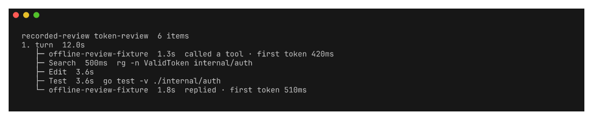

# traces




`traces` renders agent activity as a folding trace tree. The core reads OTLP
and a newline-delimited provider protocol. It does not import a harness,
observability service, difftool, terminal multiplexer, or terminal emulator.

The interactive view supports filtering, session selection, inspection, and
multi-repository change review. The key help, leader bar, and footer render
from one binding registry.

## Use it

```bash
# Attach to activity for the current directory.
traces

# Produce a stable report for automation.
traces --once --session 01abc --color never

# Keep the protocol composable in a pipeline.
traces-provider-codex --since 30m | traces --file - --once
```

See [`examples/local-harnesses`](examples/local-harnesses/README.md) and
[`examples/portable-report`](examples/portable-report/README.md) for complete
workflows.

## Configure it

Traces loads `~/.config/traces/config.yaml`. Set `TRACES_CONFIG` to select
another file. Nested environment names override YAML, such as
`TRACES_COLOR=never`, `TRACES_PROVIDERS_DIRECTORY`, or
`TRACES_DIFF_PROVIDER=git`.

```yaml
# yaml-language-server: $schema=https://raw.githubusercontent.com/roshbhatia/traces/main/schema/traces.schema.json
color: auto
sources:
  claude-code: [claude]
  codex: [codex]
  codex_cli_rs: [codex]
  opencode: [opencode]
diff:
  provider: git
```

Provider manifests use the shared `provider/v1` contract. Traces recognizes
four capabilities: `activity.read`, `session.current`, `session.discover`, and
`diff.render`. Each action defines direct argv and environment Go templates.
Traces never inserts a shell. An activity provider writes newline-delimited
spans and events to standard output. Several providers may serve one harness.
Traces merges their output and removes duplicate spans.

The `diff.render` action receives `.Local`, `.Remote`, `.Merged`, `.Width`, and
`.Color` template data. Without a diff provider, Traces uses its built-in
renderer. Rendered diffs are cached by provider manifest, width, and patch.

Traces discovers manifests in this order. The first manifest for a name wins:

1. `providers.directory` in the Traces configuration. It defaults to
   `~/.config/traces/providers`.
2. Each directory in `TRACES_PROVIDER_PATH`.
3. `share/traces/providers` beside a flat release executable.
4. `../share/traces/providers` beside an installed `bin/traces`.
5. `$XDG_DATA_HOME/traces/providers`.
6. Each `$XDG_DATA_DIRS` entry under `traces/providers`.

Harness readers live in `extras/` as separate binaries. Private providers can
stay in downstream configuration without changing or rebuilding Traces. Use
`providers/<name>/provider.yaml` for the manifest layout.

Inspect and test providers without opening the TUI:

```bash
traces provider list
traces provider validate
traces provider validate codex
```

Validation checks the manifest, templates, dependencies, and executable. It
also probes `activity.read` or `diff.render` when the provider supplies one.

Generate the schema and command reference with `traces generate`. CI uses
`traces generate --check` to reject stale output.

## Command reference
<!-- BEGIN GENERATED:cli -->

### `traces`

Inspect agent activity as a trace tree

| Option | Description |
| --- | --- |
| `--all` | Show every local run |
| `--color` `<value>` | Color output |
| `--config` `<value>` | YAML configuration file |
| `--file` `<value>` | Read an OTLP JSON file |
| `--json` | Print newline-delimited JSON |
| `--lag` `<value>` | Provider overlap window |
| `--list` | List sessions |
| `--once` | Print one trace tree |
| `--poll` `<value>` | Provider poll interval |
| `--provider` `<value>` | Read named activity providers |
| `--service` `<value>` | Filter by service |
| `--session` `<value>` | Attach by session ID or prefix |
| `--since` `<value>` | Initial provider window |

### `traces generate`

Generate README command docs and JSON Schema

| Option | Description |
| --- | --- |
| `--check` | Fail when generated files are stale |

### `traces provider`

Inspect and validate external providers

### `traces provider list`

List discovered providers

| Option | Description |
| --- | --- |
| `--config` `<value>` | YAML configuration file |
| `--json` | Print JSON |

### `traces provider validate`

Validate provider commands and protocol output

| Option | Description |
| --- | --- |
| `--config` `<value>` | YAML configuration file |
| `--json` | Print JSON |

<!-- END GENERATED:cli -->

## Development

```bash
nix develop
go test -race ./...
go run . generate --check
nix flake check
./hack/screenshots.sh
```
